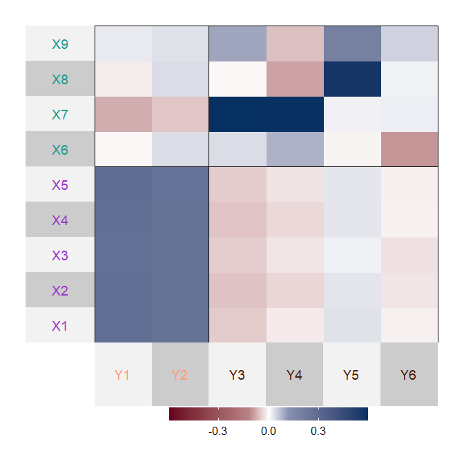
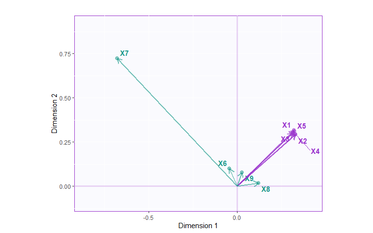

<!-- README.md is generated from README.Rmd. Please edit that file -->

# plsmfa

<!-- badges: start -->
<!-- badges: end -->

`plsmfa` is a package to perform partial least squares multiple factor
analysis (PLSMFA). PLSMFA is an extension of partial least squares
correlation (PLSC) for the case when the data contains groups of
variables called subtables. The subtables are normalized by their first
singular value, so that each contributes equally to the analysis. This
is package is in development.

## Installation

You can install `plsmfa` from
[GitHub](https://github.com/LukeMoraglia/plsmfa) with:

``` r
# install.packages("devtools")
devtools::install_github("LukeMoraglia/plsmfa")
```

`plsmfa` depends on several packages that are mostly on CRAN, but there
are some packages that are available only through GitHub. Download them
with the code below:

``` r
# Available through GitHub
devtools::install_github("HerveAbdi/PTCA4CATA")
devtools::install_github("HerveAbdi/data4PCCAR")
devtools::install_github("derekbeaton/GSVD")

# Optional modified version of ExPosition
devtools::install_github("LukeMoraglia/ExPosition1/ExPosition")
```

## Example: Simulated Data

The `sim_data` contains two data tables, `X` and `Y`, which have groups
of variables, stored in `X_design` and `Y_design`. The subtables of `X`
are `SubX1` and `SubX2` and of `Y` are `SubY1` and `SubY2`.

``` r
library(plsmfa)
data("sim_data")
X <- sim_data$X
Y <- sim_data$Y
X_design <- sim_data$X_design
Y_design <- sim_data$Y_design

head(X) %>% kable()
```

|         X1 |         X2 |         X3 |         X4 |         X5 |         X6 |         X7 |         X8 |         X9 |
|-----------:|-----------:|-----------:|-----------:|-----------:|-----------:|-----------:|-----------:|-----------:|
|  1.4298969 |  1.5087200 |  1.5593433 |  1.8359701 |  1.2409016 |  1.2009654 | -2.0009292 | -0.0046208 |  1.3349126 |
| -0.4861499 | -0.4196816 | -0.6144210 | -0.4598737 | -0.7653348 |  1.0447511 |  0.3337772 |  0.7602422 | -0.8692718 |
|  0.1629597 |  0.4066045 |  0.3824242 |  0.5572751 |  0.2561056 | -1.0032086 |  1.1713251 |  0.0389909 |  0.0554870 |
|  0.5677172 |  0.5925313 |  0.5460764 |  0.7082573 |  0.6107797 |  1.8484819 |  2.0595392 |  0.7350721 |  0.0490669 |
|  0.2025986 |  0.1311304 |  0.8400019 |  0.2050816 |  0.5243544 | -0.6667734 | -1.3768616 | -0.1464726 | -0.5783557 |
| -0.2332108 | -0.1679120 | -0.6978804 | -0.2256211 | -0.0229555 |  0.1055138 | -1.1508556 | -0.0578873 | -0.9987387 |

``` r
head(Y) %>% kable()
```

|         Y1 |         Y2 |         Y3 |         Y4 |        Y5 |         Y6 |
|-----------:|-----------:|-----------:|-----------:|----------:|-----------:|
|  0.6244420 |  0.1854115 | -1.4745524 | -2.3617590 | 0.0129692 |  1.8980617 |
| -0.5280921 | -1.2230875 | -0.7302457 |  0.2522875 | 1.9208308 |  0.8632615 |
|  0.6864380 |  1.4526364 |  1.1439127 |  0.5789615 | 0.5414974 | -0.9467181 |
|  1.0125386 |  1.1416485 |  1.8226159 |  2.5586943 | 0.6238643 |  0.9114952 |
|  1.2808248 |  0.2683617 | -1.4536954 | -1.8538973 | 0.1735249 | -0.6694729 |
|  0.8272635 | -0.2149073 | -0.4931129 | -0.9465768 | 1.0130864 |  0.3821033 |

``` r
t(X_design)
```

    #>      [,1]    [,2]    [,3]    [,4]    [,5]    [,6]    [,7]    [,8]    [,9]   
    #> [1,] "SubX1" "SubX1" "SubX1" "SubX1" "SubX1" "SubX2" "SubX2" "SubX2" "SubX2"

``` r
t(Y_design)
```

    #>      [,1]    [,2]    [,3]    [,4]    [,5]    [,6]   
    #> [1,] "SubY1" "SubY1" "SubY2" "SubY2" "SubY2" "SubY2"

### Run `plsmfa`

``` r
res_plsmfa <- plsmfa(data1 = X, 
                     data2 = Y,
                     column_design1 = X_design,
                     column_design2 = Y_design,
                     center1 = TRUE, center2 = TRUE,
                     scale1 = "SS1", scale2 = "SS1")
```

### The cross-product matrix of the normalized data

Once each subtable is normalized by its first singular value, PLSMFA
computes the cross-product matrix of the normalized data tables and
decomposes this cross-product matrix using the SVD. We can see the
cross-product matrix using:

``` r
X_var_color <- sim_data$X_var_color$oc
Y_var_color <- sim_data$Y_var_color$oc

normed_R <- t(res_plsmfa$normed_X) %*% res_plsmfa$normed_Y
R_bound <- max(max(normed_R), abs(min(normed_R)))

superheat::superheat(normed_R,
                     membership.rows = X_design,
                     membership.cols = Y_design,
                     left.label = 'variable',
                     bottom.label = 'variable',
                     heat.lim = c(-R_bound, R_bound),
                     heat.pal = c("#67001F", "white", "#053061"),
                     heat.pal.values = c(0, 0.4, 0.5, 0.6, 1),
                     left.label.text.col = X_var_color,
                     bottom.label.text.col = Y_var_color
                     )
```

<!-- -->

### Statistical inference

The package contains permutation testing to test the eigenvalues, and
bootstrap resampling to evaluate the stability of the loadings. These
features are fully developmental, and they have not been fully
validated. Note that if your data are large, these can take a while to
run.

``` r
res_perm <- perm_plsmfa(data1 = X, 
                        data2 = Y,
                        column_design1 = X_design,
                        column_design2 = Y_design,
                        center1 = TRUE, center2 = TRUE,
                        scale1 = "SS1", scale2 = "SS1",
                        n_iter = 1000,
                        compact = TRUE,
                        bootstrap_first_singval = TRUE)
```

``` r
res_boot <- boot_plsmfa(data1 = X, 
                        data2 = Y,
                        column_design1 = X_design,
                        column_design2 = Y_design,
                        center1 = TRUE, center2 = TRUE,
                        scale1 = "SS1", scale2 = "SS1",
                        n_iter = 1000,
                        n_dimensions = 3,
                        boot_ratio_threshold = 2)
```

### Some graphs

#### Scree

First up, check the eigenvalues.

``` r
PTCA4CATA::PlotScree(ev = res_plsmfa$pls$l,
                     p.ev = res_perm$p_eig,
                     plotKaiser = TRUE, 
                     alpha = 0.01)
```

<!-- -->

The first 3 dimensions explain nearly all of the variance, and each one
has *p* \< .01.

#### Loadings (a.k.a saliences)

The loadings of the variables show their importance for a dimension (in
PLSC, these loadings are also called saliences). We can look at the
loadings as arrows on a 2D plot, where arrows with a small angle between
them are positively related on these dimensions. Loadings for `X` are
stored in `res_plsmfa$pls$u` and for `Y` in `res_plsmfa$pls$v`.

``` r
X_load_12 <- loading_plot(loadings = res_plsmfa$pls$u,
                          axis1 = 1, axis2 = 2,
                          col_points = X_var_color,
                          arrows = TRUE)

X_load_12$plot
```

<!-- -->

``` r
Y_load_12 <- loading_plot(loadings = res_plsmfa$pls$v,
                          axis1 = 1, axis2 = 2,
                          col_points = Y_var_color,
                          arrows = TRUE)

Y_load_12$plot
```

<!-- -->

#### Latent Variables

The observations of the analysis can be plotted on latent variables
(akin to principal components in PCA). Observations can be colored by a
design variable (i.e., a categorical grouping variable) and the means of
the groups can be plotted. Bootstrap confidence intervals of the means
give an idea of how stable the group means are on the latent variables.

``` r
lv1 <- latent_variable_XY_map(res_plsmfa,
                              lv_num = 1,
                              design = sim_data$obs_design,
                              col_obs = sim_data$obs_color,
                              col_group = sim_data$group_color)
lv1$plot
```

<!-- -->
